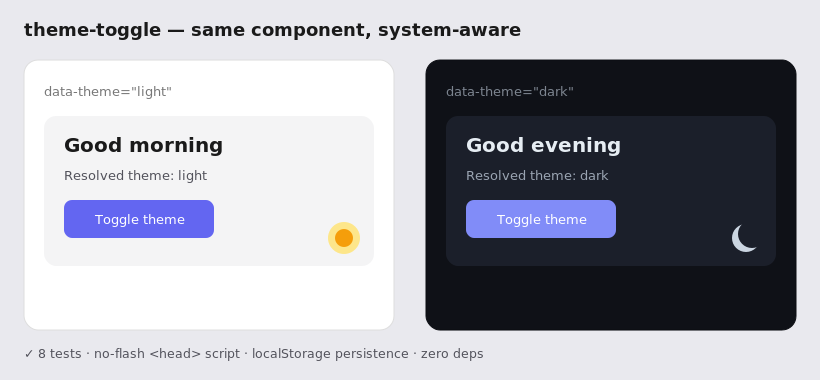

# theme-toggle-ts

[](https://github.com/JCreatesGH/theme-toggle/actions)
[](https://www.typescriptlang.org/)
[](LICENSE)

Dark-mode theming done properly: respects the OS `prefers-color-scheme`, lets users override to light/dark/system, persists the choice, and ships a tiny inline script that **prevents the flash of wrong theme** on first paint. Framework-agnostic, zero dependencies.



## Install

```bash
npm install theme-toggle-ts
```

## Usage

```ts
import { ThemeEngine } from "theme-toggle-ts";

const engine = new ThemeEngine();      // reads storage + OS preference, applies data-theme
engine.toggle();                       // light <-> dark, persisted
engine.set("system");                  // follow the OS again
engine.cycle();                        // light -> dark -> system -> … (tri-state button)
engine.resolved;                       // "light" | "dark" (after resolving "system")

// React to changes (e.g. update an icon). In "system" mode this also fires when
// the OS flips light/dark while the page is open.
const off = engine.subscribe((resolved) => updateIcon(resolved));
// ...later: off();  engine.destroy();
```

Style off the attribute:

```css
:root            { --bg: #fff; --fg: #111; }
[data-theme=dark]{ --bg: #0f1117; --fg: #e6edf3; }
body { background: var(--bg); color: var(--fg); }
```

### No flash of wrong theme

Drop this in `<head>` **before** your stylesheet so the correct theme is set before first paint:

```html
<script>
  // import { noFlashScript } from "theme-toggle-ts" to generate this string
  (function(){try{var t=localStorage.getItem('theme')||'system';
   var d=t==='dark'||(t==='system'&&matchMedia('(prefers-color-scheme: dark)').matches);
   document.documentElement.setAttribute('data-theme',d?'dark':'light');}catch(e){}})();
</script>
```

## API

- `new ThemeEngine(options?)` — `{ storageKey, attribute, element, store, matchMedia }`, all injectable (which is why it's 100% testable without a DOM).
- `.theme` → `"light" | "dark" | "system"` (the user's choice)
- `.resolved` → `"light" | "dark"` (what's actually applied)
- `.set(theme)` · `.toggle()` · `.cycle()` — change the theme
- `.subscribe(listener)` → returns an unsubscribe fn; fires on every resolved-theme change, **including live OS light/dark switches while in `system` mode**
- `.destroy()` — detach the OS listener and drop subscribers
- `noFlashScript()` · `resolveTheme()` · `systemPrefersDark()`

A runnable `demo.html` is included.

## Development

```bash
npm install && npm test    # 14 tests
```

## License

MIT
